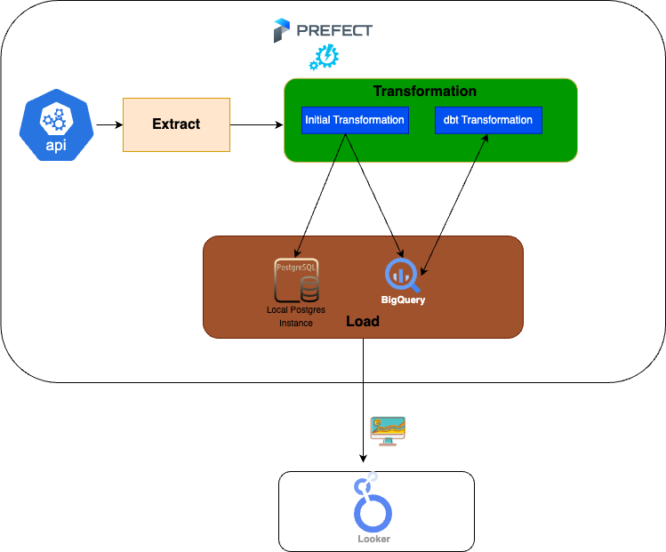

**Data Source**  
OpenWeather's [Air Pollution API](https://openweathermap.org/api/air-pollution) was used to get the historical AQI for the cities. The geo-coordinates of the capital cities need to be passed as parameters to the API to get the result. The API offers weather data up to one hour prior.

**Architecture and Tools Used**  

**Link to the Visualization in Looker Studio**  
[Visualization]([https://lookerstudio.google.com/reporting/e34ade9a-d478-46d0-8531-1f9b62acbe02/page/P67mD](https://lookerstudio.google.com/reporting/e34ade9a-d478-46d0-8531-1f9b62acbe02/page/P67mD))

A short walkthrough of the solution:  

<iframe width="663" height="330" src="https://www.youtube.com/embed/lXv__DY_QaQ" title="A short demo using dbt + BigQuery + Python + Pandas + Prefect" frameborder="0" allow="accelerometer; autoplay; clipboard-write; encrypted-media; gyroscope; picture-in-picture; web-share" allowfullscreen></iframe>
